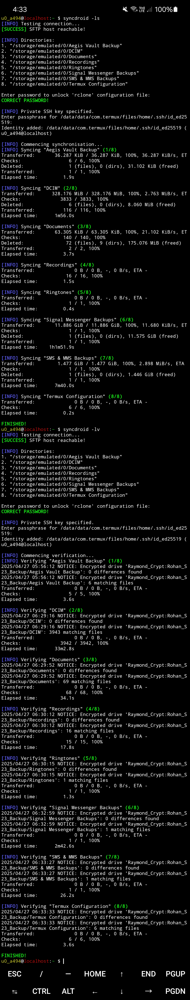

# SyncDroid
`SyncDroid` is a Bash script designed to synchronise specified directories from an Android device to an onsite or offsite `rclone` remote. It ensures that files and folders on the Android device remain unmodified whilst keeping the `rclone` remote up-to-date. With `SyncDroid`, any changes or updates are applied solely to `rclone` remotes, ensuring that the source directories and the destination remote remain identical.



## Features
- **Sync Folders**: Synchronise selected directories from an Android device to an `rclone` remote.
- **Verify Files**: Verify the integrity of remote data by comparing checksums.
- **Onsite & Offsite Remotes**: In keeping with the '3-2-1' backup rule, supports use of both an offsite and onsite `rclone` remote.
- **Automatic Directory Cleanup**: Optionally remove directories on `rclone` remotes that are no longer listed for synchronisation.
- **Encryption**: Supports on-device encryption by specifying 'crypt' `rclone` remotes in the `SyncDroid` configuration.
- **Customisable**: User settings are loaded from a configuration file.

## Usage

```bash
syncdroid (--sync | --verify) [--local]
syncdroid (-s | -v) [-l]
```

### Options
- `--sync` or `-s`: Sync the specified directories on the Android device to the remote.
- `--verify` or `-v`: Verify the integrity of files on the remote using checksums.
- `--local` or `-l`: Use the onsite remote instead of the offsite remote.

### Example Commands

```bash
# Sync (Offsite)
syncdroid --sync

# Verify (Offsite)
syncdroid --verify

# Sync (Onsite)
syncdroid --sync --local

# Verify (Onsite)
syncdroid --verify --local
```

## Installation
1. Configure storage access permissions and install `rclone` on the Android device within [`Termux`](https://termux.dev/en/).

    ```bash
    pkg update && pkg upgrade
    termux-setup-storage
    pkg install netcat-openbsd
    pkg install rclone
    ```

2. Download `SyncDroid` and transfer the necessary files to their appropriate locations.

    ```bash
    # Switch to the home directory.
    cd "$HOME"

    # Clone the GitHub repository.
    git clone https://github.com/KernelGhost/SyncDroid

    # Create the required directories.
    mkdir -p "${HOME}/.config/syncdroid"
    mkdir -p "${HOME}/.scripts"

    # Move the relevant files to the new directories.
    cp "${HOME}/SyncDroid/config.sh" "${HOME}/.config/syncdroid"
    cp "${HOME}/SyncDroid/directory_sync_list.txt" "${HOME}/.config/syncdroid"
    cp "${HOME}/SyncDroid/syncdroid.sh" "${HOME}/.scripts"

    # Mark 'syncdroid.sh' as executable.
    chmod +x "${HOME}/.scripts/syncdroid.sh"

    # (Optional) Delete the GitHub repository.
    rm -r "${HOME}/SyncDroid"
    ```

3. Add the following code snippet to your `~/.bash_profile`.

   ```bash
   source ~/.scripts/syncdroid.sh
   ```

## Configuration
### Offsite `rclone` Remote
The following instructions are specific to configuring a Google Drive remote, but can be substituted for your offsite remote of choice. See the [`rclone` documentation](https://rclone.org/docs/) for more information.

#### Google Drive Client ID Creation
It is recommended you create your own 'client ID' to access your personal Google Drive using `rclone`, as the default `rclone` client ID is shared between all `rclone` users and is subject to a global rate limit on the number of queries per second. The following instructions are taken from [this guide](https://rclone.org/drive/#making-your-own-client-id).

1. Log into the [Google API Console](https://console.developers.google.com/) with your Google account.

2. Create a new project (or select an existing project).

3. Under "ENABLE APIS AND SERVICES" search for "Drive", and enable the "Google Drive API".

4. Click "Credentials" in the left-side panel (NOT "Create credentials").

5. Click "CONFIGURE CONSENT SCREEN", then select "External" and click on "CREATE".

6. On the next screen, enter an "Application name" (e.g. "rclone"). Enter your own email for both the "User Support Email" as well as the "Developer Contact Email". All other fields are optional, so proceed by clicking "Save".

7. Add the following scopes in order to be able to edit, create and delete files on `Google Drive` with `rclone`. Once the required scopes are added, click "Save and continue".
    - `.../auth/docs`
    - `.../auth/drive`
    - `../auth/drive.metadata.readonly`

8. You will be requested to add test users on the next screen. Ensure you add your own account to the test users. Once you've saved the changes, click again on "Credentials" on the left panel to go back to the "Credentials" screen.

9. Click on the "+ CREATE CREDENTIALS" button at the top of the screen, then select "OAuth client ID".

10. Choose an application type of "Desktop app" and click "Create". The default name will suffice.

> [!IMPORTANT]
> The creation wizard will display a client ID and client secret, which should be noted down and stored in a safe location (e.g. a password database).

11. Click "Oauth consent screen" and then click "PUBLISH APP".

> [!NOTE]
> Although Google expects users to "submit applications for verification", you can go right ahead and use the client ID and client secret with `rclone` without verification. The only issue will be a very scary confirmation screen shown when you grant your application access to your Google drive in order to generate a token-id for `rclone`, but this is not a big deal.

#### Google Drive Remote Configuration
1. Run `rclone config` and then enter `n` to create a new remote.

2. Enter a name for the new remote (e.g. "GDrive").

3. Select 'Google Drive' as the type of storage to configure by entering `drive` (a list of options will be displayed to select from).

4. Provide the remote configuration wizard with the 'Client ID' and 'OAuth Client Secret' from previous steps.

5. Select 'Full access all files, excluding Application Data Folder' as the remote access scope by entering either `1` or `drive` (once again, a list of options will be displayed to select from).

6. Enter `n` to skip editing the advanced configuration options.

7. Enter `y` to use a web browser on the Android device to authenticate and generate an access token. Navigate to the URL returned by the configuration wizard and grant access for the requested permissions.

8. Enter `n` to avoid configuring this new remote as a shared drive ('Team Drive').

9. Enter `y` to save this newly configured remote.

#### Encrypted 'Wrapper' Remote Configuration
A remote of type crypt does not access a storage system directly, but instead wraps another remote, which in turn accesses the storage system.

1. Run `rclone config` and then enter `n` to create a new remote.

2. Enter a name for the new remote (e.g. "CryptGDrive").

3. Select 'crypt' as the type of storage to configure by entering `crypt` (a list of options will be displayed to select from).

4. Enter `GDrive:Rclone_Encrypted_Directory` as the remote to encrypt/decrypt (where 'Rclone_Encrypted_Directory' is the folder within your Google drive in which encrypted data will be stored).

5. Enter `1` or `standard` to encrypt the filenames.

6. Enter `1` or `true` to encrypt directory names.

7. Enter `y` to enter a password for the encryption process.

8. Enter `g` to generate a random password for salt generation. Ensure you enter `1024` to ensure the highest possible password strength in bits.

> [!IMPORTANT]
> Be sure to record both passwords in a secure location (e.g. a password manager).

9. Enter `y` to confirm the use of the entered/generated passwords.

10. Enter `n` to avoid editing the advanced configuration options.

11. Enter `y` to save the newly created encrypted remote.

---

### Onsite `rclone` Remote
#### SFTP Remote Configuration
The following instructions are specific to configuring a `sftp` remote, but can be substituted for your onsite remote of choice. See the [`rclone` documentation](https://rclone.org/docs/) for more information.

1. Run `rclone config`.

2. Enter `n` to create a new remote.

3. Enter a name for the new remote (e.g., "sftp_remote").

4. Enter `sftp` as the type of storage to configure.

5. Enter the IP address (or mDNS hostname) of the machine to connect to (e.g., "Raymond.local" or "192.168.0.20").

> [!IMPORTANT]
> If you plan on using a plain IPv4 address, be sure to configure a static IP address for the host system.

6. Enter the username you would like to use for authentication on the host (e.g., "rohanbarar").

7. Enter the port number you wish to use for establishing the SFTP connection. This is usually the default port "22" unless you have customised your configuration.

8. Enter the password corresponding to the user specified earlier.

9. Leave all key-related fields blank, including `key_pem`, `key_file` and `pubkey_file`. In addition, enter `n` for `key_file_pass`.

10. Enter `false` to avoid forcing the use of `ssh-agent`.

11. Enter `false` to prevent the use of insecure ciphers and key exchange methods.

12. Enter `false` to allow execution of SSH commands to determine if remote file hashing is available.

13. Leave the final field blank so as to avoid using an external ssh binary.

14. Enter `n` to avoid editing the advanced configuration options.

15. Enter `y` to save the newly created encrypted remote.

##### Onsite Remote w/ Online Access
It is possible to configure your home server to be securely accessible over the internet using `sftp`, allowing `rclone` to connect remotely via key-based authentication across a non-standard port.

This approach assumes you have already:

1. Disabled CGNAT by contacting your ISP.

2. Set up Dynamic DNS (DDNS) to associate your changing public IP with a fixed hostname (e.g. `example.url.net`), including configuring a daemon on your home server to periodically update this automatically.

3. Configured an additional SSH daemon on your home server to listen on a non-standard port (e.g. `2817`) and accept key-based authentication only.

4. Generated an OpenSSH key pair using the secure `Ed25519` algorithm, with the private key protected by a strong passphrase.

5. Enrolled the public key on the home server by adding it to `~/.ssh/authorized_keys`, and stored the matching password-protected private key on the Android device at `~/.ssh/id_ed25519`.

5. Configured your home router to:
    - Assign a static internal IP address to your home server via MAC address binding.
    - Forward traffic on the chosen non-standard port (e.g. `2817`) to the home server’s static internal IP address.

6. Configured protection against attacks by blocking repeated failed login attempts and enforcing adequate lockout times.

Set up the `sftp` remote as described above, with the following differences:

1. Specifying the Dynamic DNS (DDNS) URL instead of an mDNS hostname or internal IP address.

2. Specifying the chosen non-standard port instead of the default `22`.

3. Entering `true` when asked whether to force the use of `ssh-agent`.

#### Encrypted 'Wrapper' Remote Configuration
Follow the same instructions for creating an encrypted remote as above. For example, if the SFTP remote is named `Raymond`, the encrypted wrapper remote can be configured to use `Raymond:/home/rohanbarar/encrypted_rclone_sync`.

### Final Steps
1. Use a password to encrypt the `rclone` configuration file.
    1. Run `rclone config` and enter `s` to set a password for the configuration file.
    2. Enter `a` to add a password, followed by the password to be used to secure the configuration file.
    3. Enter `q` to quit to the main menu.

> [!IMPORTANT]
> The password used to secure the configuration file will need to be entered each time a command is run, so it is important to store this in a safe location (e.g. a password manager).

2. `SyncDroid` utilises a text file located at `~/.config/syncdroid/directory_sync_list.txt` to specify the directories on the Android device to sync or verify. Each line in the file should contain one directory path relative to the device root (e.g., `DCIM`, `My Pictures/Family`, etc.). Edit this file to specify which directories to sync. Instructions are provided within the file for how to list directories correctly.

> [!TIP]
> To back up files in your `Termux` home directory, create symlinks in your home folder that point to the actual files located in a folder named `Termux Home Folder` within the root folder of your Android device. Then, `Termux Home Folder` can simply be added to `directory_sync_list.txt`.
> For example, `ln -s "/storage/emulated/0/Termux Home Folder/.bash_profile" "/data/data/com.termux/files/home/.bash_profile"`

3. Modify `${HOME}/.config/syncdroid/config.sh` to reflect your `rclone` setup and desired settings. Instructions are provided within the file for how to correctly adjust these settings.

## License
This project is licensed under the GNU GPLv3 License. See the [LICENSE](./LICENSE) for details.
